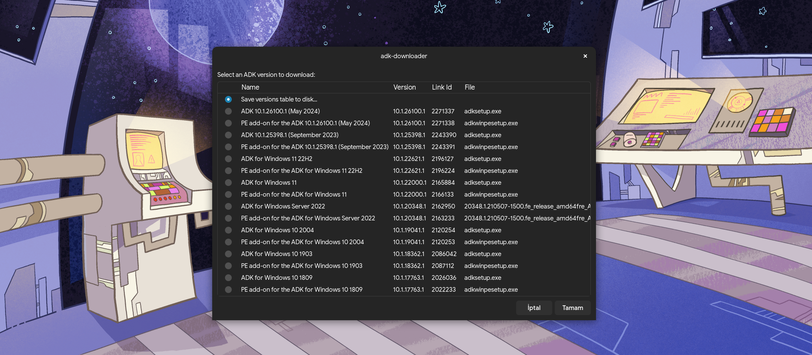

# adk-downloader

A Bash script to pull versions of [Windows Assessment and Deployment Kit (Windows ADK)](https://learn.microsoft.com/en-us/windows-hardware/get-started/adk-install) from the same linked page, extract installer & download the packages, so they can be carried to a Windows machine later without depending on any initial Windows machine to download ADK.



It pretty much does the same what ADK installer does on Windows more or less by letting to pick specific features you would like to download, also it is way more faster since it uses aria2 to make concurrent downloads.

## Usage

For interactive graphical usage, simply run the script.

If running under TTY or if you prefer using it in CLI, run `--help` for usage & commands:

```
./adk_downloader.sh --help
```

This script depends on `zenity` (not mandatory if in TTY or using from CLI), `aria2c`, `7z` and `xmlstarlet` other than standard GNU utilities. 

## License

This program is licensed under GNU GPL v3 (or later).

This program is distributed in the hope that it will be useful, but WITHOUT ANY WARRANTY; without even the implied warranty of MERCHANTABILITY or FITNESS FOR A PARTICULAR PURPOSE. See the GNU General Public License for more details.