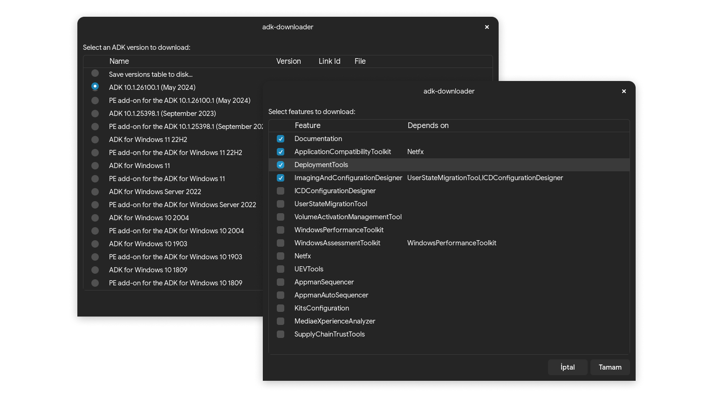

# adk-downloader

An Bash script to query versions of [Windows Assessment and Deployment Kit (Windows ADK)](https://learn.microsoft.com/en-us/windows-hardware/get-started/adk-install), extract & download them, so they can be used in a Windows machine later without depending on any initial Windows OS to download ADK. It pretty much does the same what ADK installer does on Windows more or less, also it is way more faster since it uses aria2 to make concurrent downloads.



## Usage

For interactive graphical usage, simply run the script.

If running under TTY or if you prefer using it in CLI, run `--help` for usage & commands:

```
./adk_downloader.sh --help
```

This script depends on `zenity` (not mandatory if in TTY or using from CLI), `aria2c`, `7z` and `xmlstarlet` other than standard GNU utilities. 
